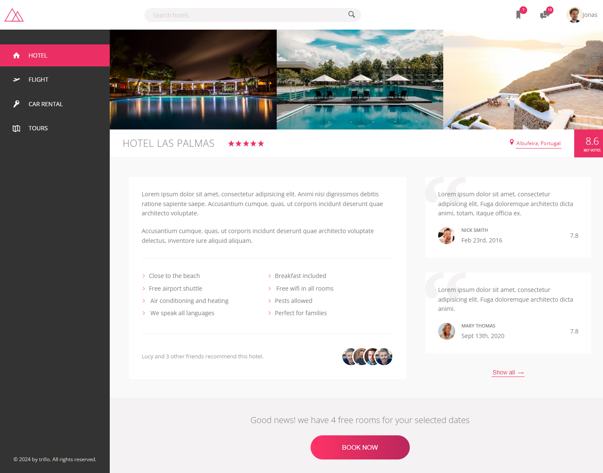

# trillo

    

## Intro 🚀

-   trillo is a simple one-page hotel booking landing page.

## Technologies 🛠️

-   `HTML`
-   `CSS`
-   `SASS`

## Features 💡

-   Responsive Design: Ensures the page looks great and functions well on all devices, including desktops, tablets, and smartphones.
-   Interactive Elements: Smooth animations and transitions that enhance the user experience without overwhelming the visitor.

## Learnings 📚

-   How to work with Flexbox.

## Running the Project 🚦

-   Clone the repository to your machine: `https://github.com/mounirabcire/trillo.git`

-   Install dependencies: `cd trillo` `npm install`

-   Open up your live server

-   Open up your browser

## Demo 📸

-   You can start exploring the website here: [trillo](https://trillo-sable.vercel.app/ "trillo")
